# 我的学习笔记

---
## 一.课程介绍:
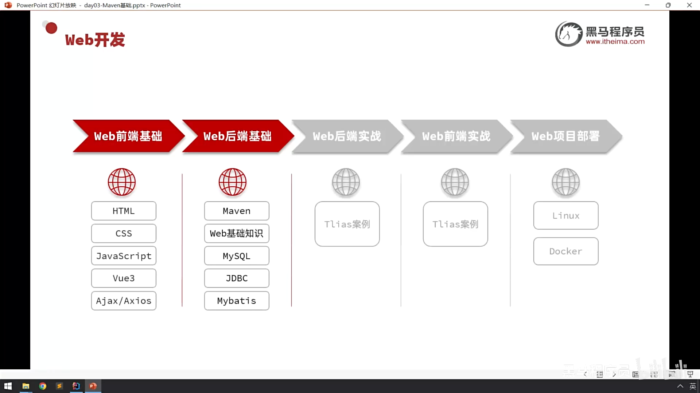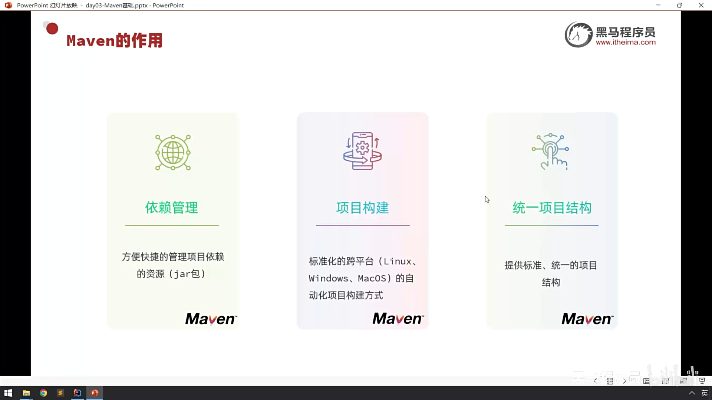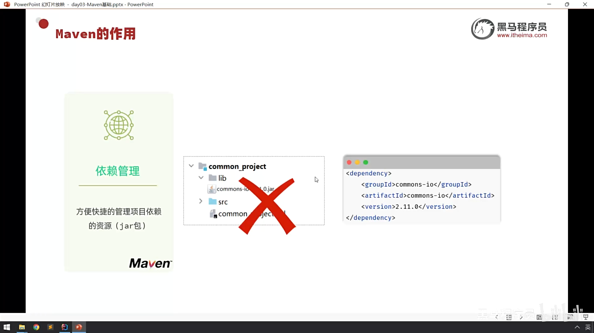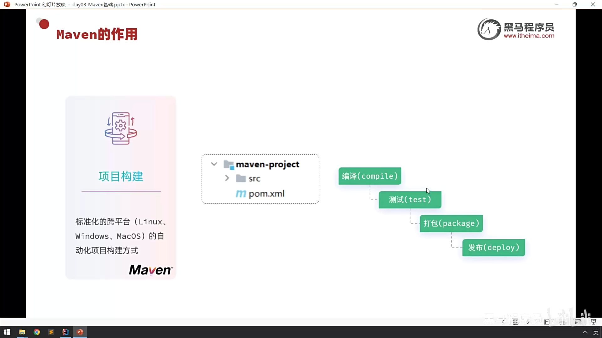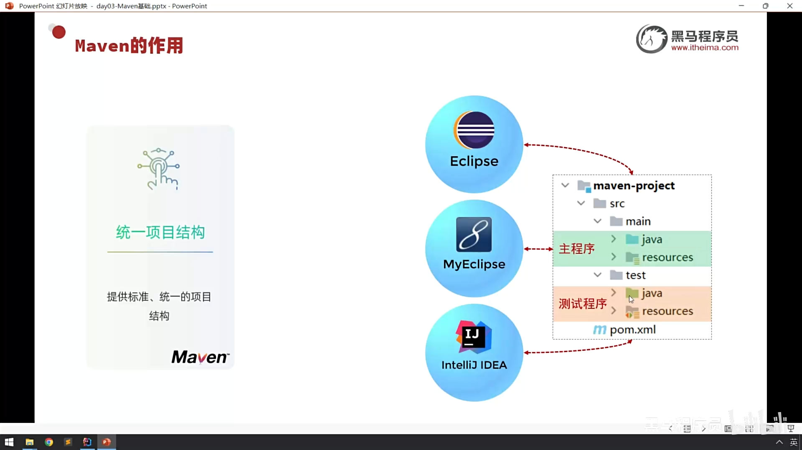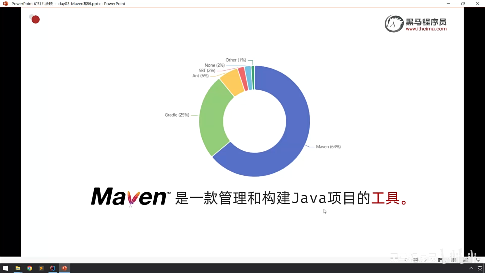

## 二.maven安装:
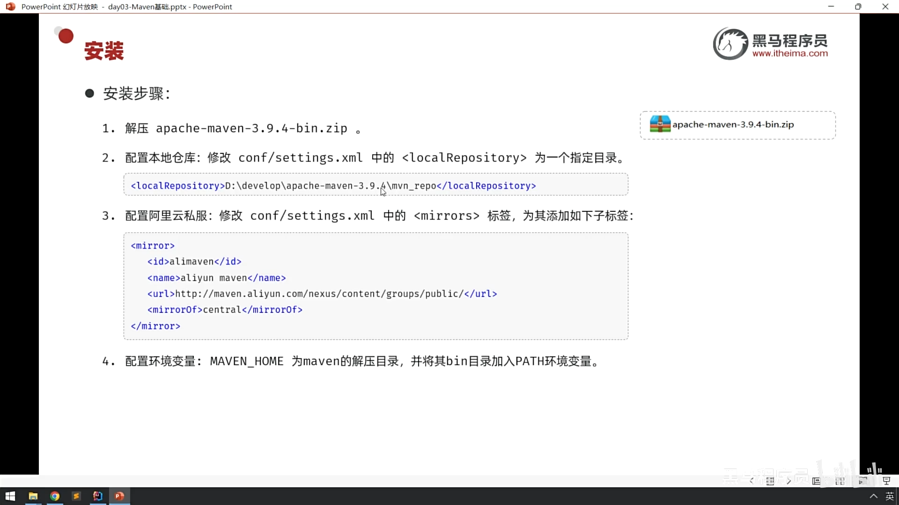

## 三.maven概述介绍:
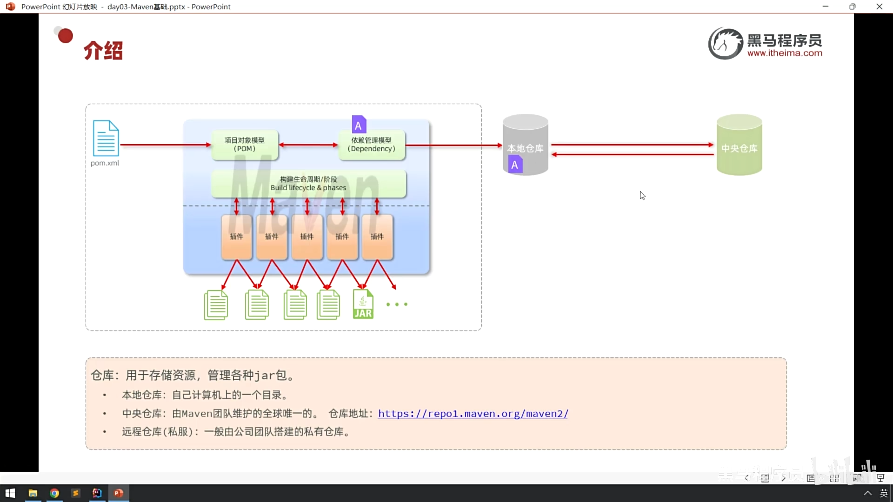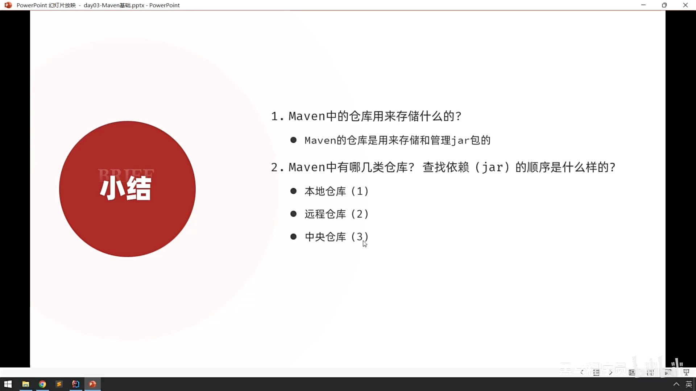

## 四.IDEA集成:
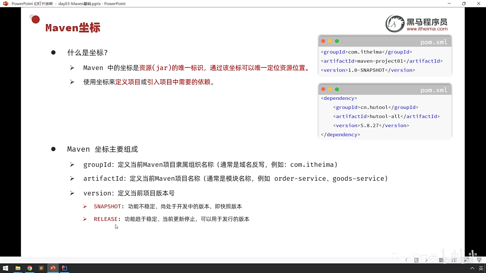
**一句话概括: Maven 坐标是一个项目（通常是一个 JAR 包或 WAR 包）在 Maven 世界里独一无二的、唯一的“身份证号”。**

核心比喻：GPS 定位
你可以把 Maven 坐标想象成一个精确的 GPS 定位。
要在一个巨大的地球上找到一个唯一的地点，你需要至少三个信息：经度 (Longitude)、纬度 (Latitude) 和 海拔 (Altitude)。
同样，要在浩如烟海的 Maven 仓库（地球）中找到一个唯一的构件 (Artifact)（比如一个 JAR 包），
 

**你也需要至少三个核心信息：groupId, artifactId 和 version。**

*Maven 坐标的主要组成部分*
 
一个完整的 Maven 坐标由以下几个部分组成，其中前三个是必须的。
1. groupId (必需) 
   含义：“组织ID” 或 “团体ID”。它定义了这个项目隶属于哪个组织、公司或团体。 
   GPS比喻：相当于纬度，或者更形象地说，是国家和城市（比如：中国，北京）。它圈定了一个大的范围。 
   命名规范：为了保证全球唯一性，官方强烈推荐使用反向的公司域名 (reversed domain name)。 
   如果公司域名是 mycompany.com，那么 groupId 就应该是 com.mycompany。 
   如果项目是 Apache 软件基金会的，那么 groupId 就是 org.apache。  
2. artifactId (必需) 
   含义：“构件ID” 或 “项目ID”。它是在一个 groupId 范围内，这个项目的唯一名称。 
   GPS比喻：相当于经度，或者说是街道和门牌号（比如：中关村大街1号）。它在国家和城市这个大范围内，进行了精确定位。 
   命名规范：使用全小写字母，并且用连字符 - 作为多个单词的分隔符。  
3. version (必需) 
   含义：“版本号”。它定义了这个项目当前处于哪个版本。 
   GPS比喻：相当于海拔，或者说是楼层号（比如：15楼）。同一个门牌号的楼，不同的楼层是不一样的。 
   命名规范：通常采用 主版本号.次版本号.修订号 的格式（例如 6.3.5）。 
   SNAPSHOT: 表示这是一个快照版/开发版，还不是稳定的正式版。  
4. packaging (可选) 
   含义：“打包方式”。它定义了这个项目最终会被打成什么类型的包。 
   常见类型： 
   jar (默认值): 这是最常见的，代表一个标准的 Java 库。如果不写 <packaging> 标签，Maven 默认就是 jar。 
   war: 代表一个 Web 应用，用于部署到 Tomcat 等服务器。 
   pom: 代表这个项目是一个父模块，它只用于管理子模块，本身不包含代码。 
   示例：<packaging>war</packaging>

## 五.导入maven项目:
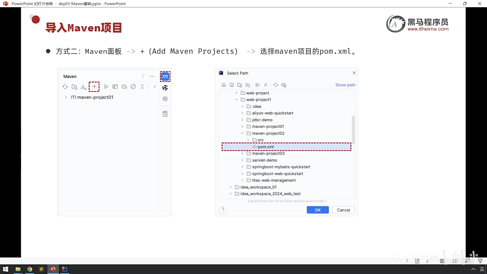

## 六.依赖管理:
### 1.配置依赖   
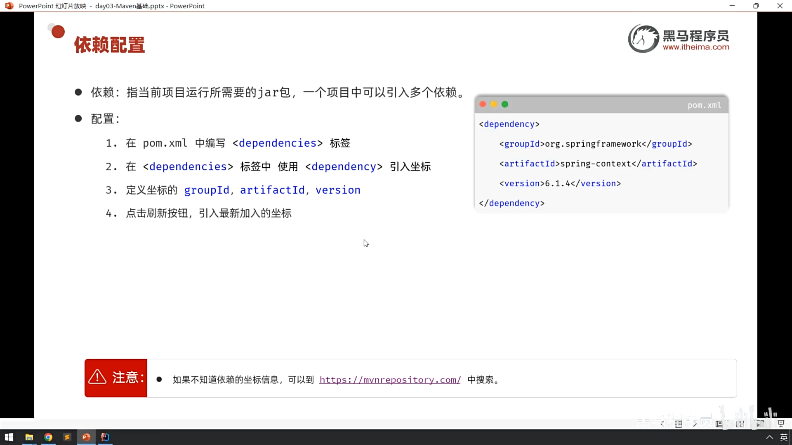

### 2.排除依赖
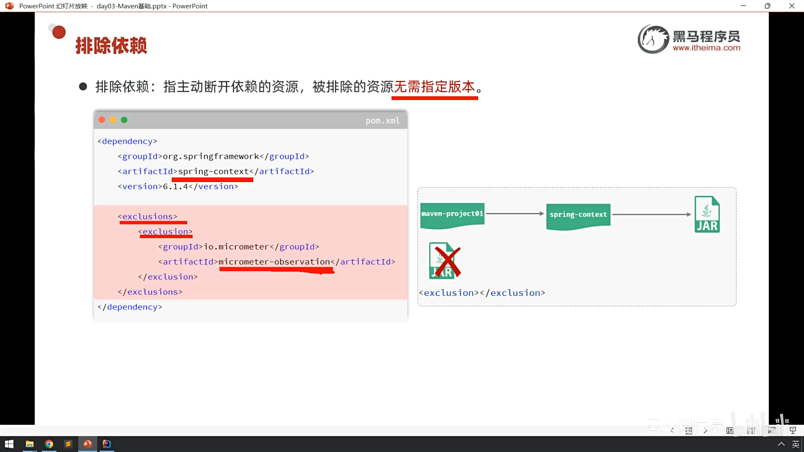

## 三.生命周期
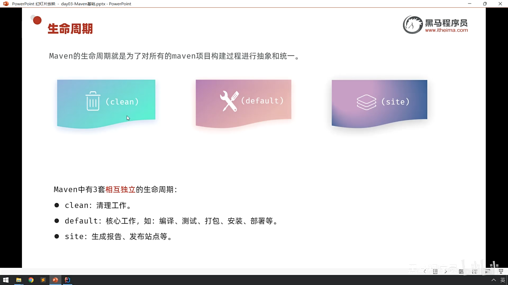
1.clean : 清理 - 删除上次构建的产物（target 目录）。 
2.compile : 编译 - 将 Java 源代码（.java）编译成字节码（.class）。 
3.test : 测试 - 运行单元测试代码。 
4.package : 打包 - 将编译后的代码打包成 jar 或 war 文件。 
5.install : 安装 - 将打好的包安装到你电脑的本地仓库，供其他项目使用。  
