# 单元测试

## 一.概述
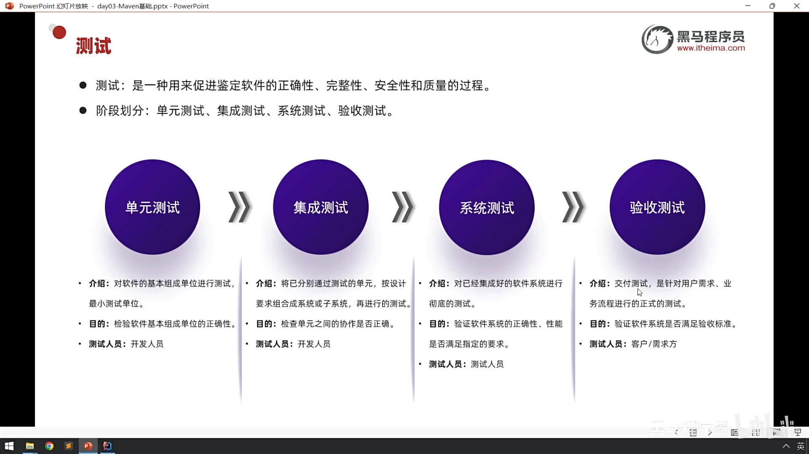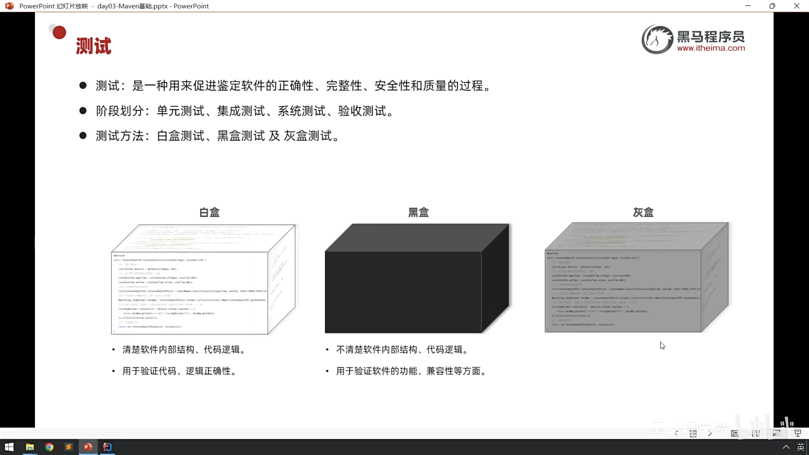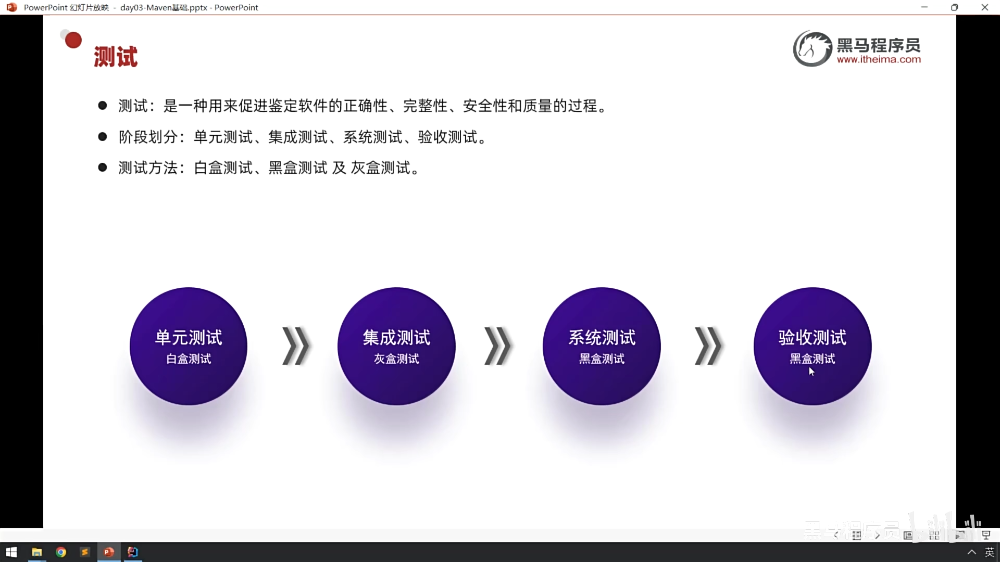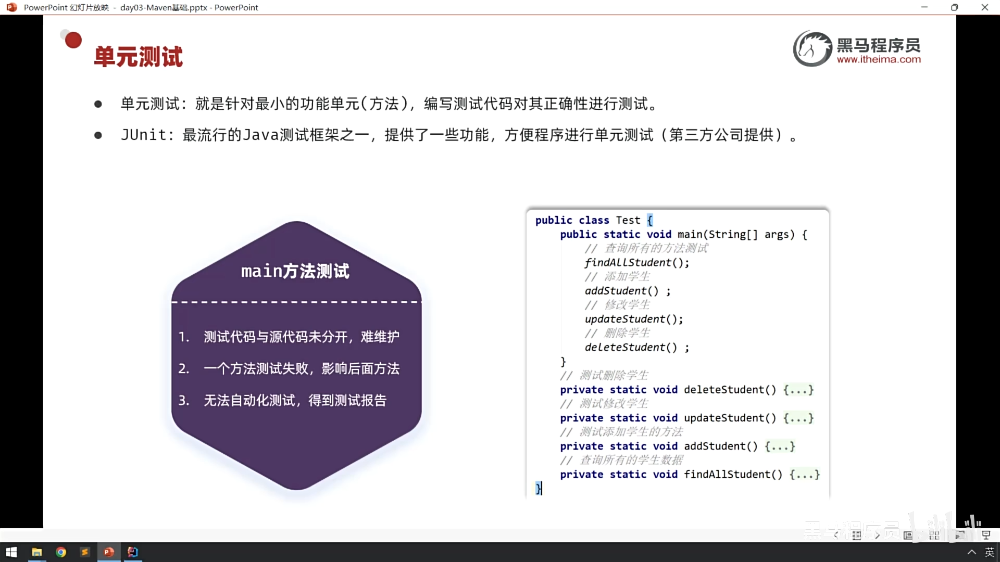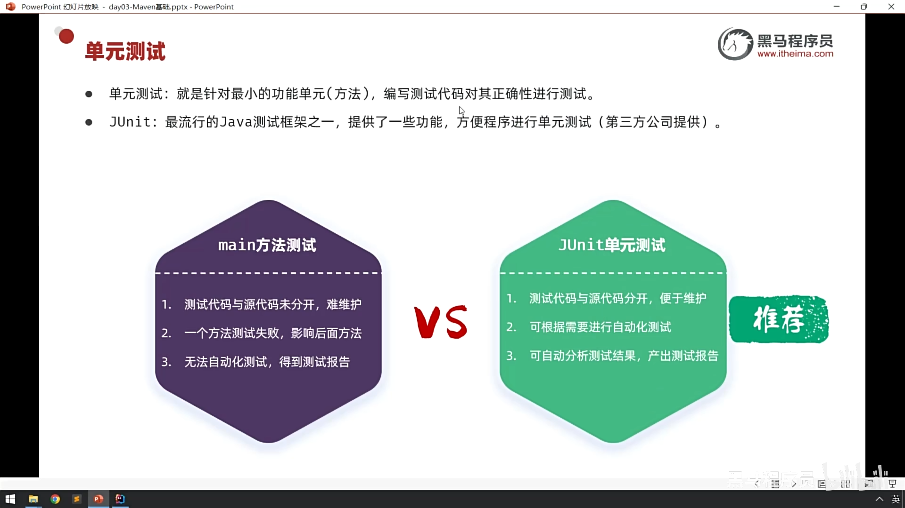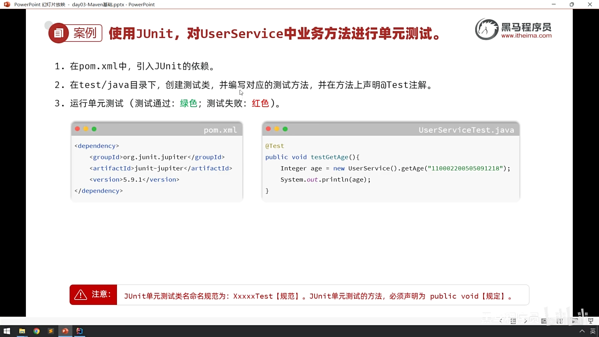
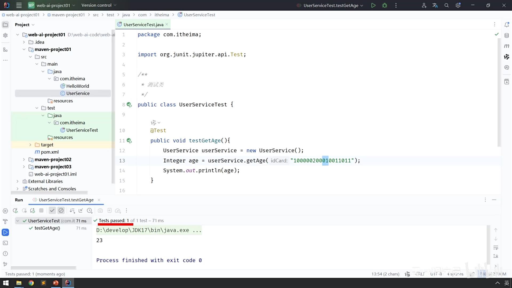

### 使用JUnit，对Userservice中业务方法进行单元测试。
1. 在pom.xml中，引入JUnit的依赖 
2. 在test/java目录下，创建测试类，并编写对应的测试方法，并在方法上声明@Test注解。 
3. 运行单元测试(测试通过:绿色;测试失败:红色)。 

**注意: 
JUnit单元测试类名命名规范为:XxxxxTest【规范】。 
Junit单元测试的方法，必须声明为 public void【规定】**

## 二.常见注解
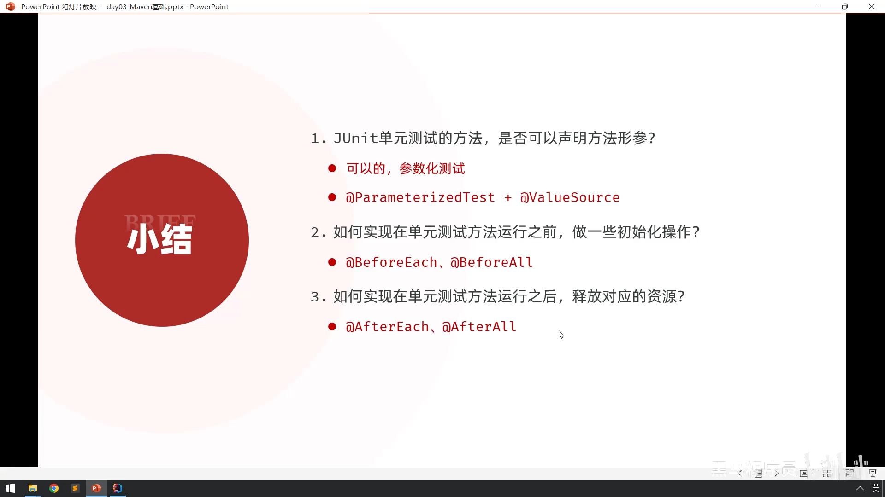

## 三.断言
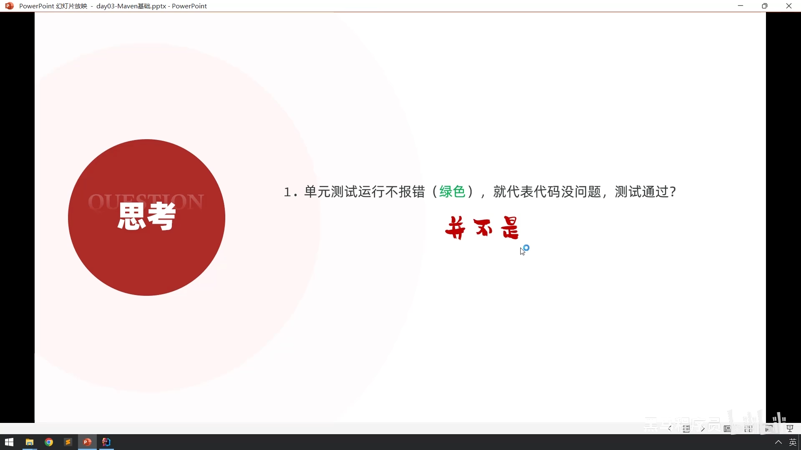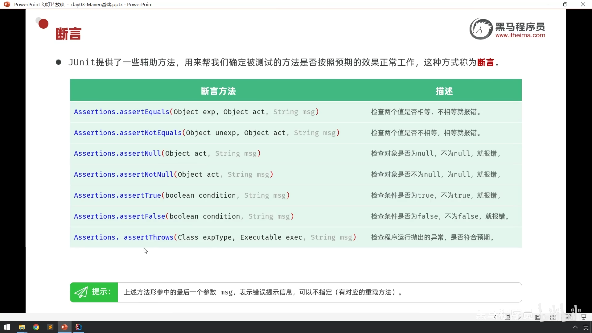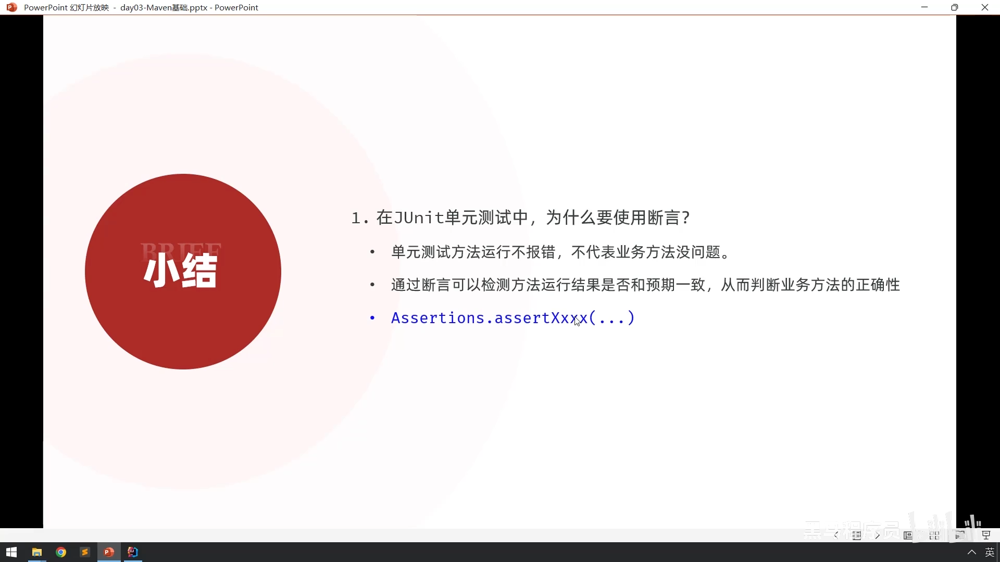

**在JUnit单元测试中，为什么要使用断言? 
小结: 
单元测试方法运行不报错，不代表业务方法没问题，
通过断言可以检测方法运行结果是否和预期一致，从而判断业务方法的正确性. 
Assertions.assertXxxx(...)**

## 四.企业开发规范
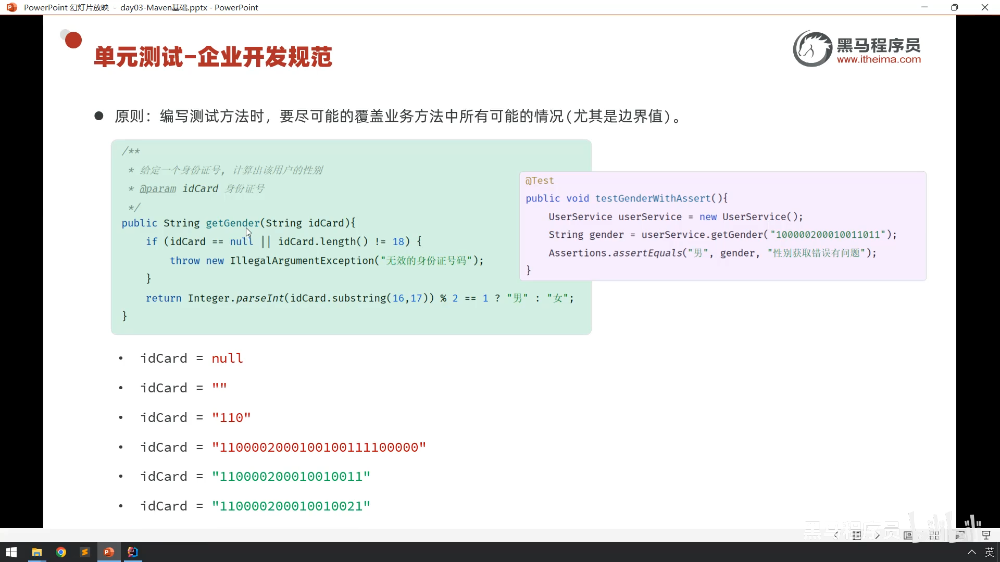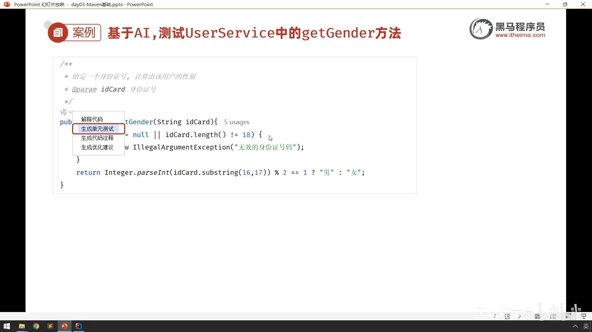

## 五.依赖范围
**依赖的jar包，默认情况下，可以在任何地方使用。可以通过`<scope>...</scope>`设置其作用范围。**
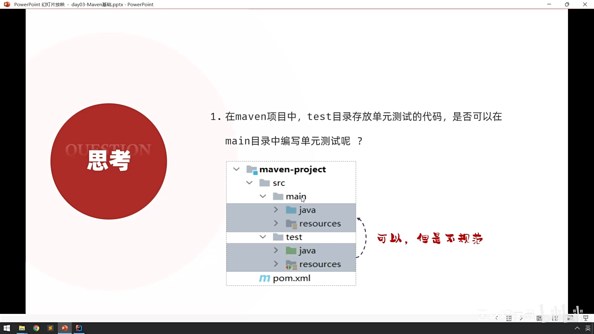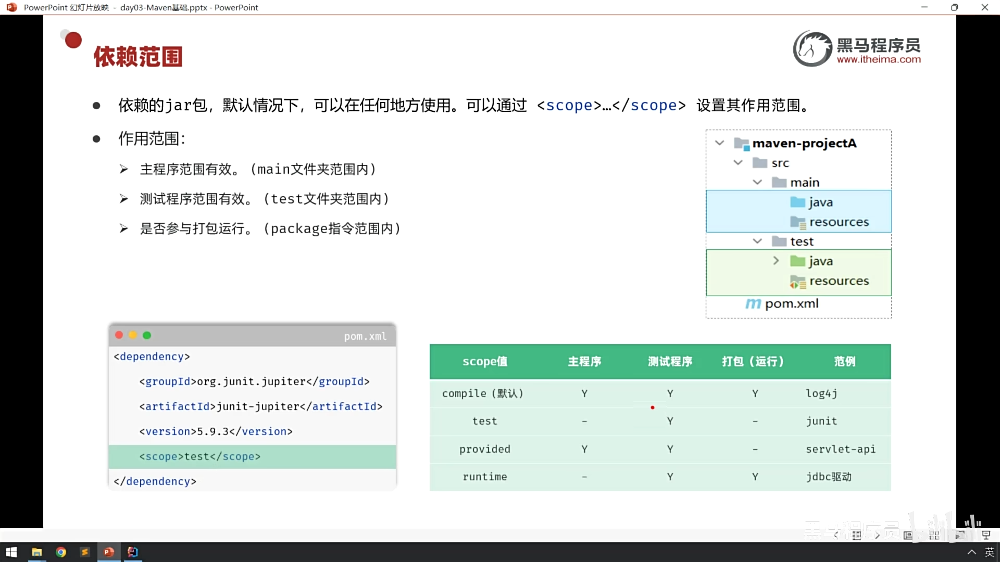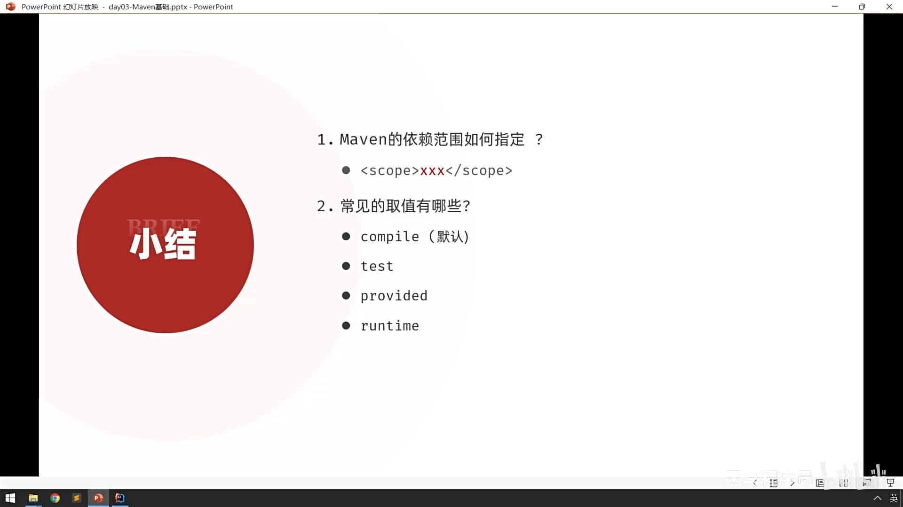

