# Web基础

---
## 一.课程安排

## 二.SpringBootWeb入门程序
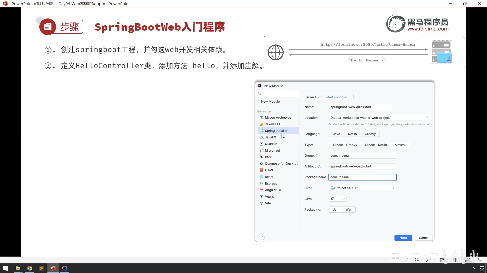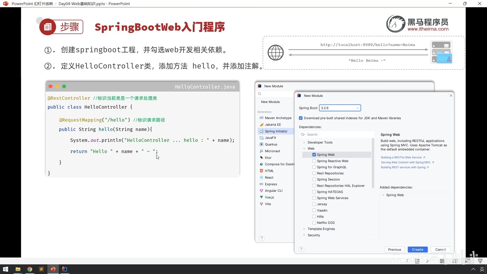

## 二.Spring官方脚手架连接不上的解决方法
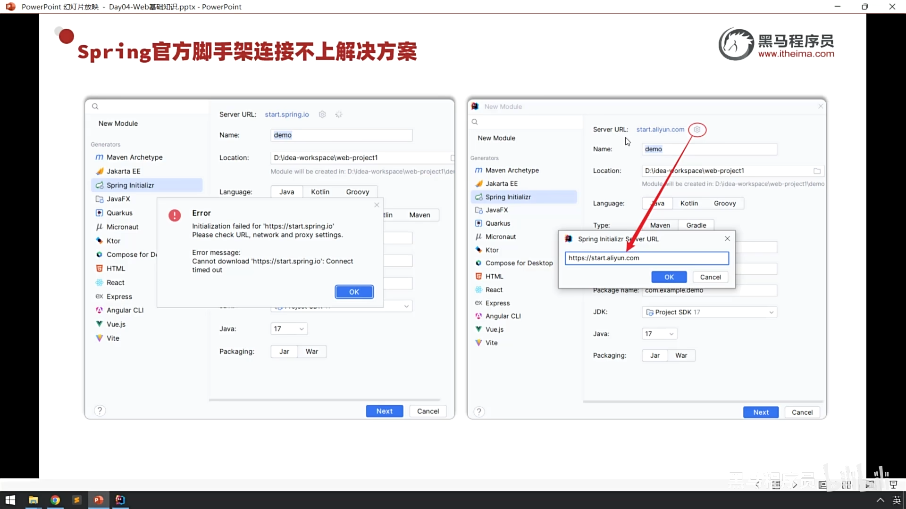

## 三.入门程序剖析
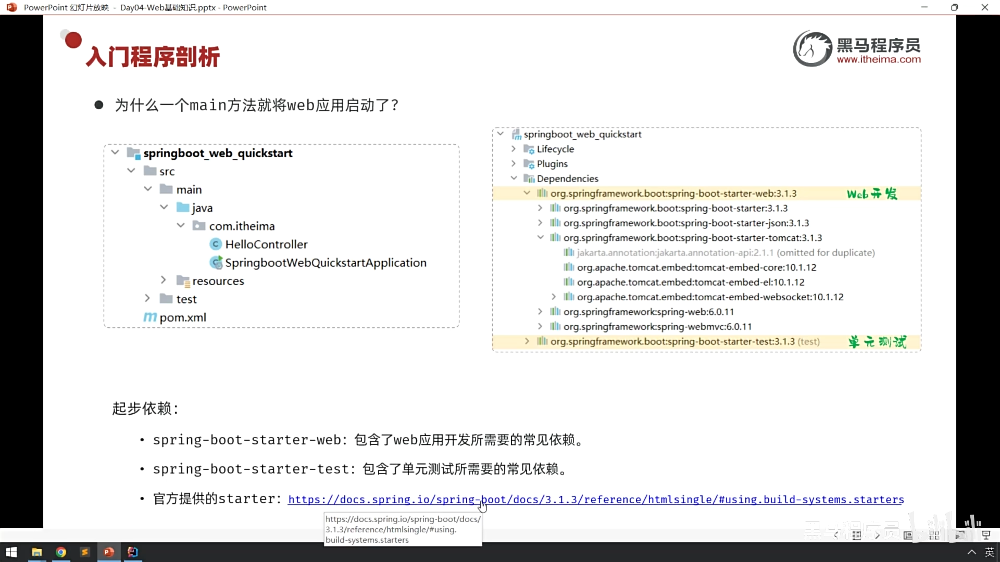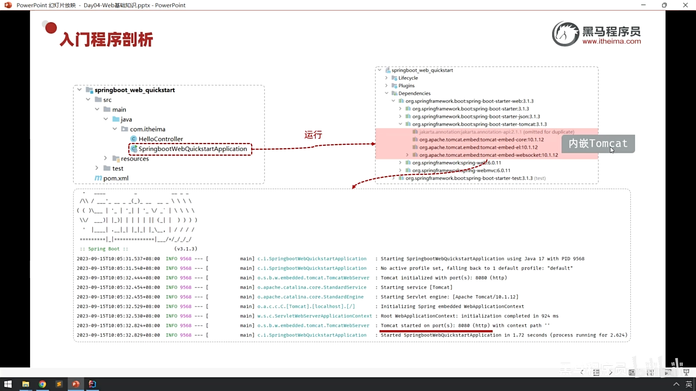

## 四.HTTP协议-概述
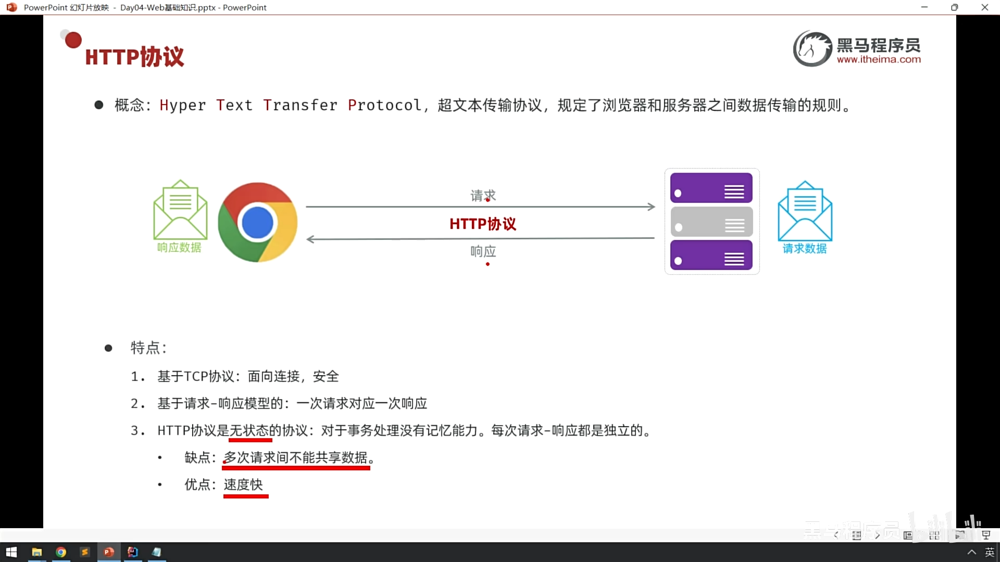

## 五.HTTP协议-请求协议-请求数据格式
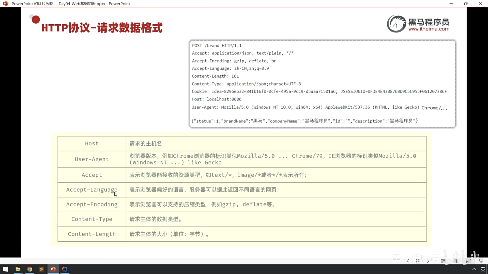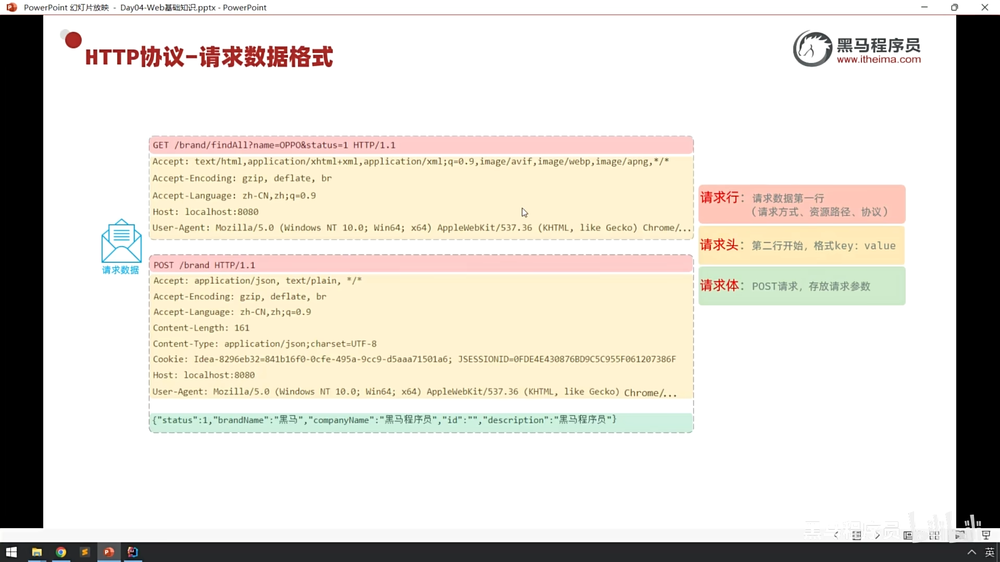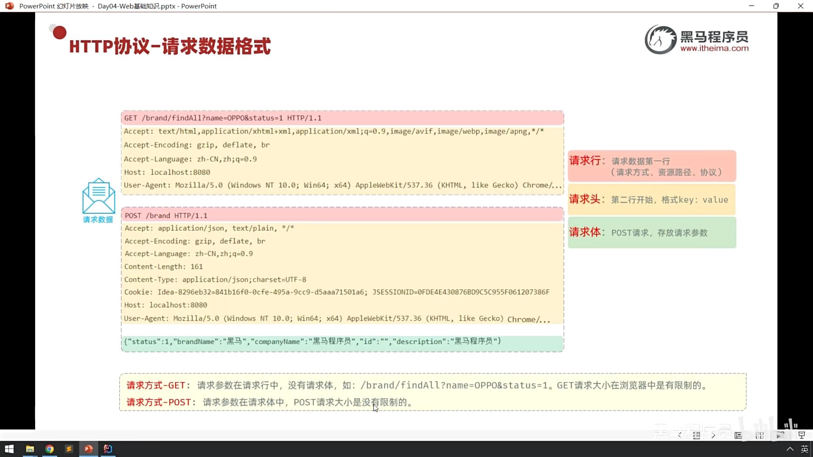

## 五.HTTP协议-请求协议-请求数据获取
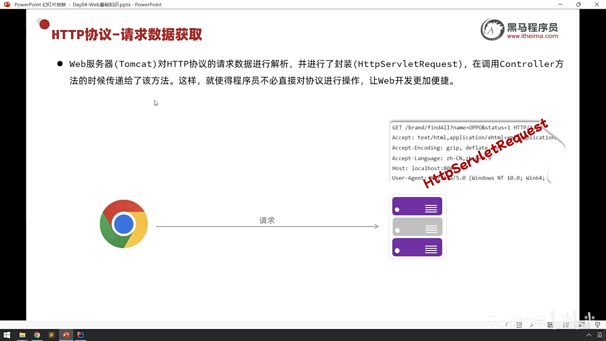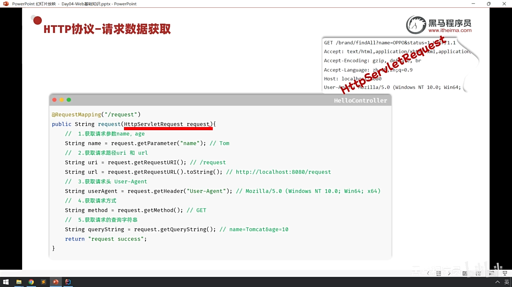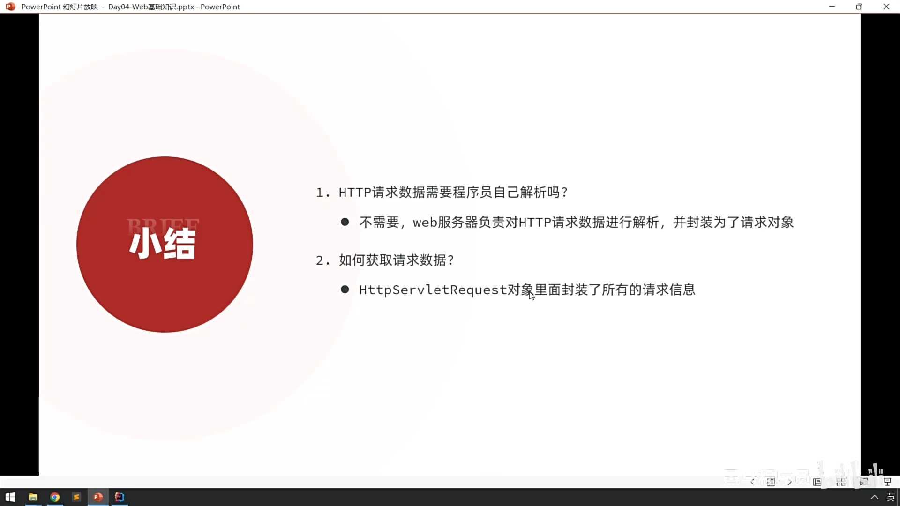

## 六.HTTP协议-响应协议-响应数据格式
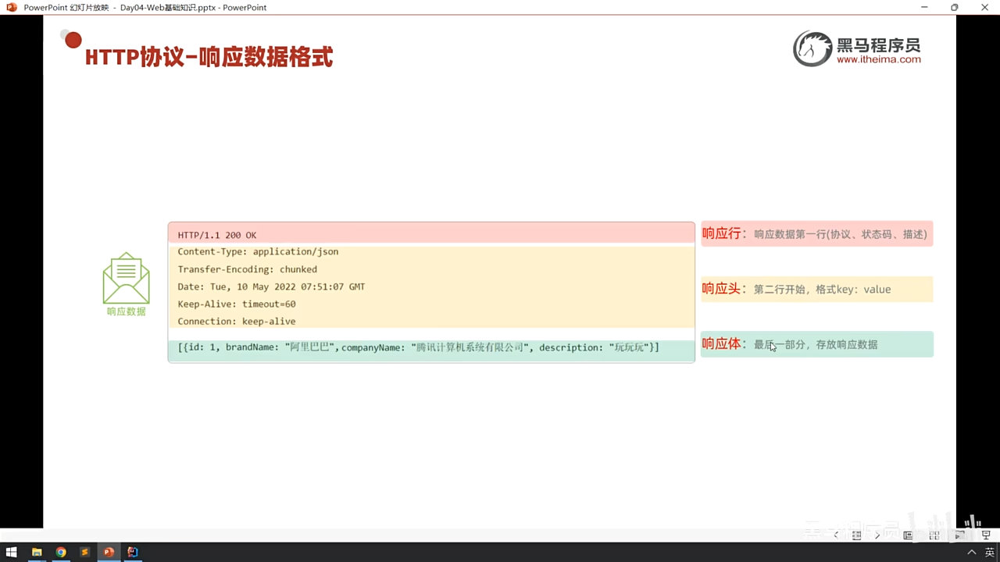
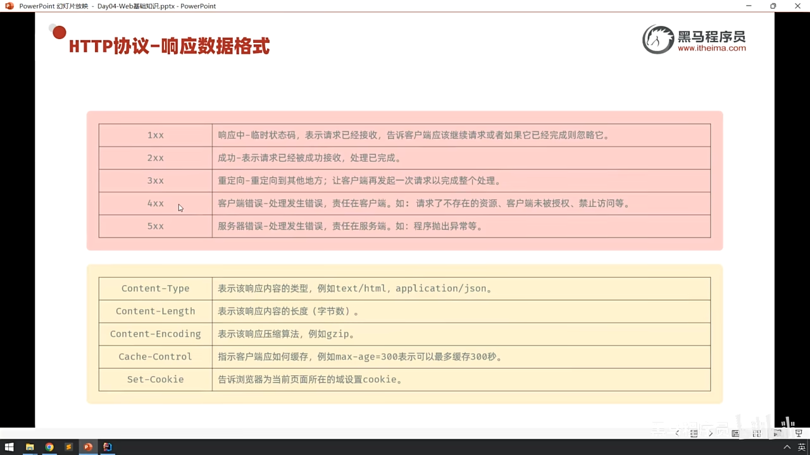
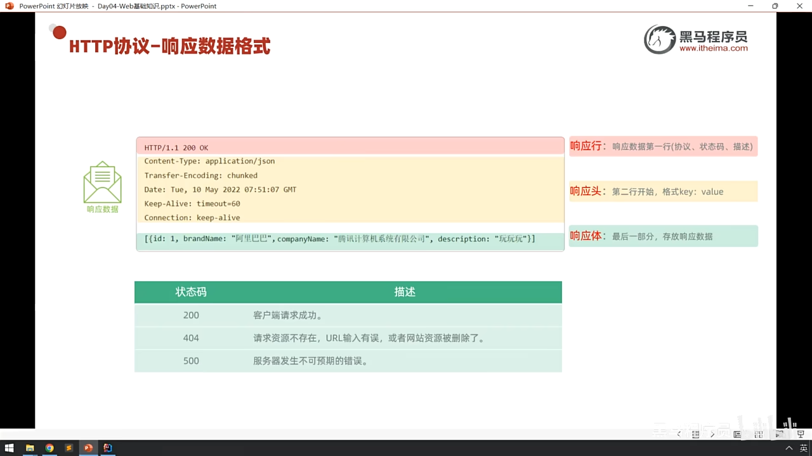

## 六.HTTP协议-响应协议-响应数据设置
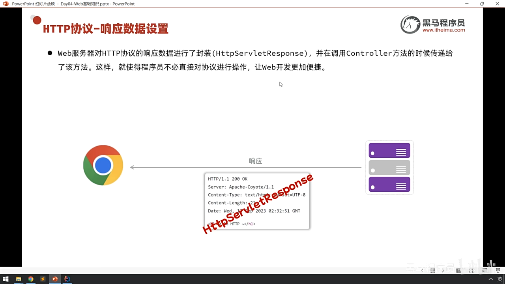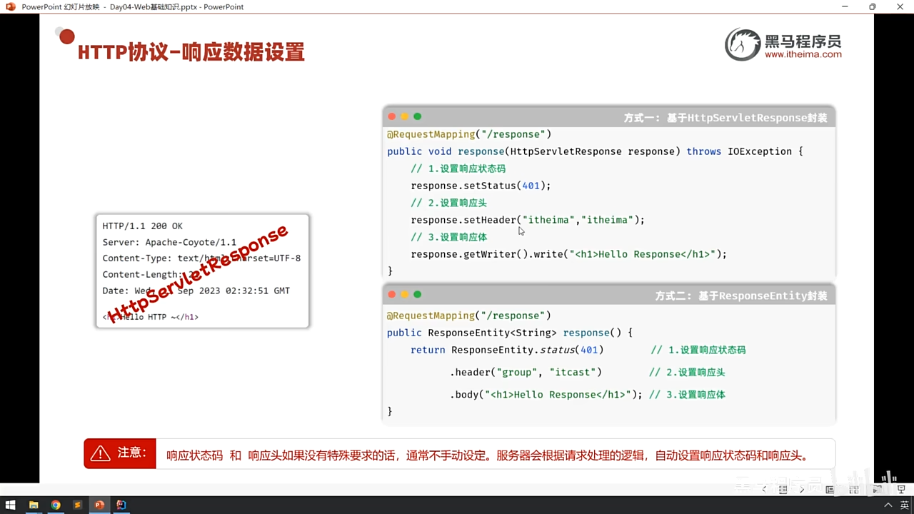

