# JDBC 

### 01.入门程序
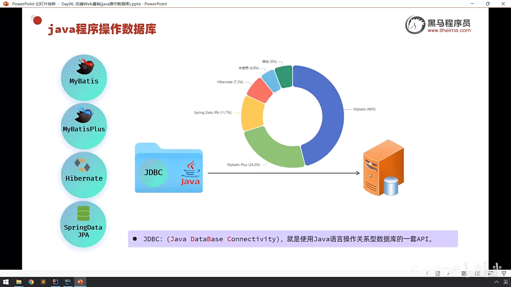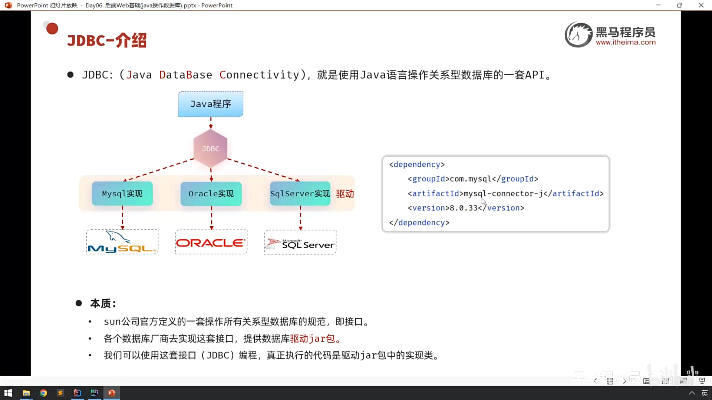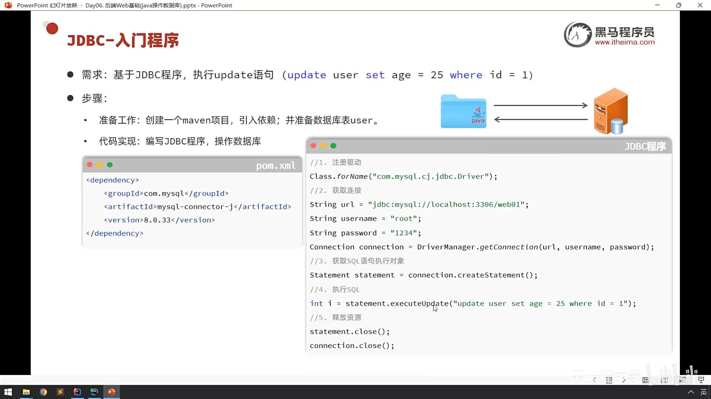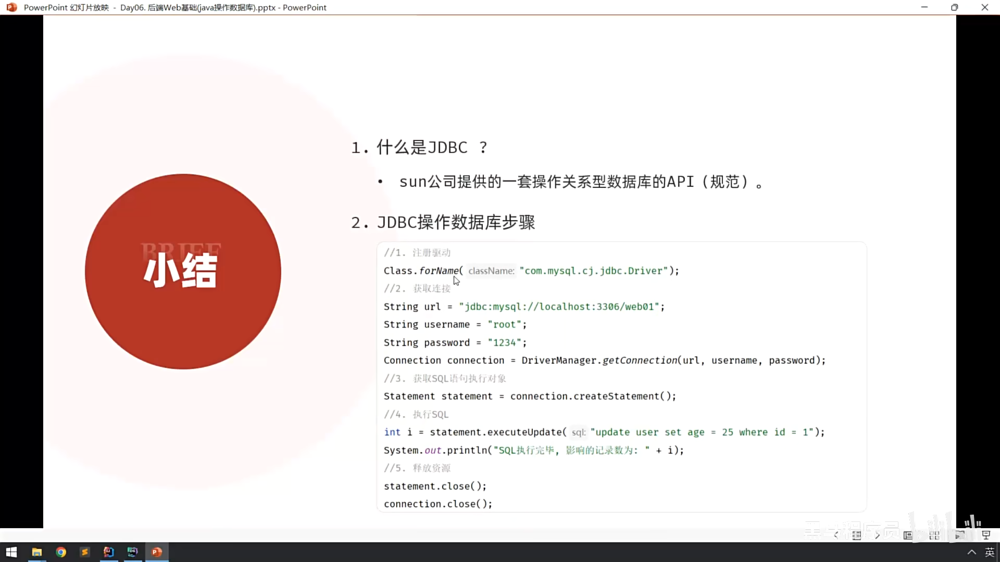

### 02.执行DQL语句
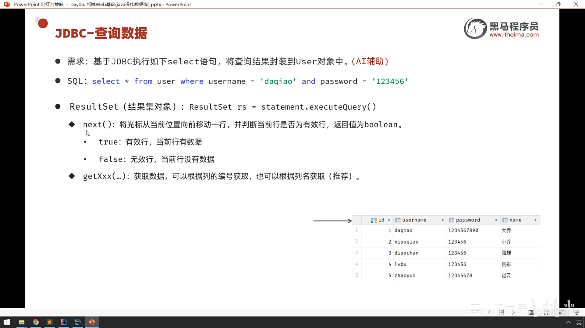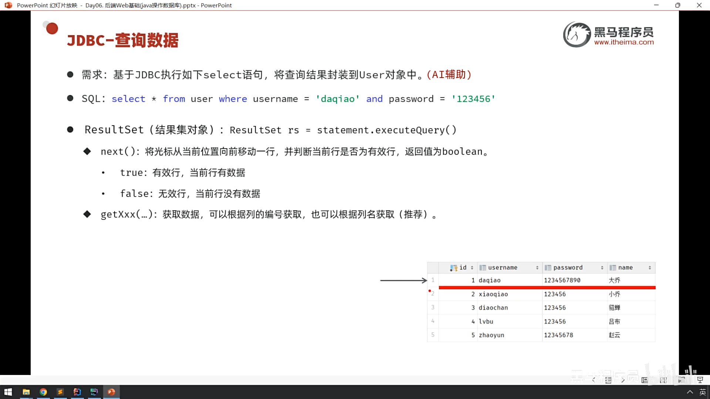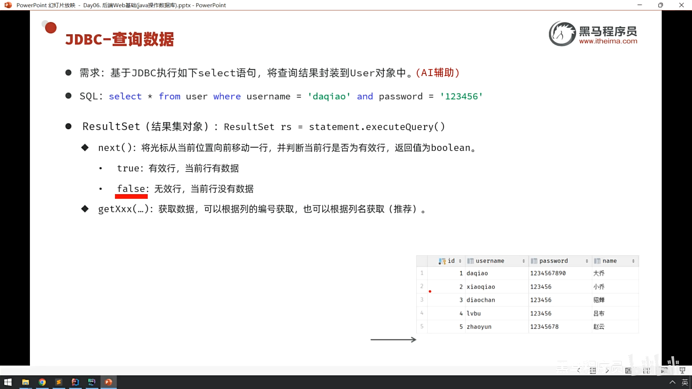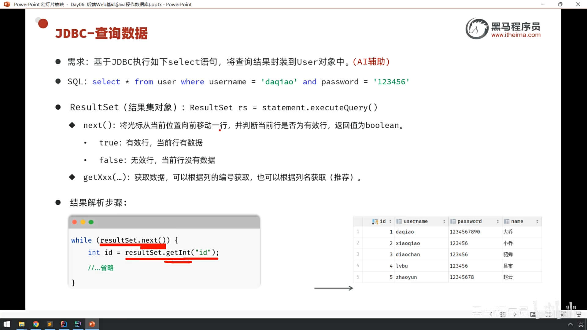
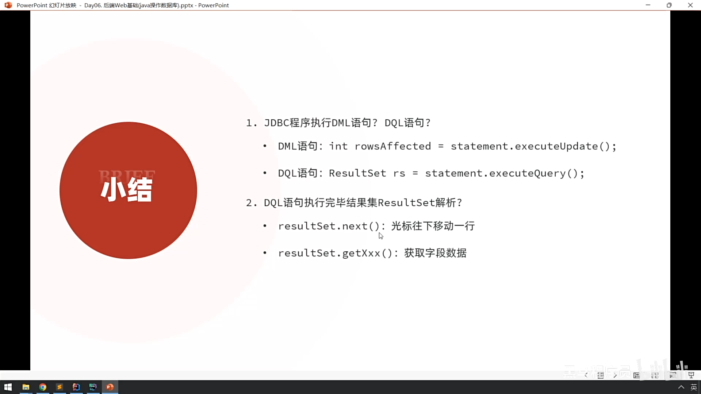

## 声明JDBC对象（解析）：  
Connection conn = null; 
PreparedStatement stmt = null; 
ResultSet rs = null; 
1. Connection conn (连接对象)
   角色：“高速公路 / 电话线”
   作用：建立 Java 程序与数据库之间的物理通道。
   详细解释：
   在代码中，DriverManager.getConnection() 就是在拨号或修路。
   只有路修通了（conn 不为空），后续的数据才能传输。
   它还负责管理事务（比如：如果你想让几条 SQL 语句要么全成功，要么全失败，就需要靠 conn 来控制）。
   在您的代码中：
   conn 代表了您的 Java 程序和 MySQL 数据库之间已经握手成功，可以开始对话了。
2. PreparedStatement stmt (预编译语句对象)
   角色：“运货卡车 / 快递员”
   作用：负责搬运 SQL 语句发送给数据库执行。
   详细解释：
   为什么要“预编译”（Prepared）？ 普通的 Statement 像是一张白纸，每次都要现写。而 PreparedStatement 像是一张填空题试卷（SQL 模板）。
   防黑客：因为使用了 ? 作为占位符，它能有效防止 SQL 注入攻击（这是它最重要的特性）。
   更高效：数据库非常喜欢这种预编译的语句，执行速度通常比普通 Statement 更快。
   在您的代码中：
   stmt 把 SELECT ... WHERE username = ? 这句 SQL 装上车，然后把 "daqiao" 和 "123456" 这两个参数填入 ? 的位置，最后把车开进数据库去执行。
3. ResultSet rs (结果集对象)
   角色：“包裹 / 货物清单”
   作用：用来接收数据库返回的数据。
   详细解释：
   当 stmt.executeQuery() 执行完毕后，数据库查到的所有数据（比如 ID、用户名、年龄等）都会被打包放在 rs 这个对象里。
   它就像一张虚拟的 Excel 表格，但这表格刚回来时，指针是指向第一行之前的。
   我们需要用 while(rs.next()) 让指针一行一行往下走，然后用 rs.getInt() 或 rs.getString() 把格子里面的数据取出来。
   在您的代码中：
   rs 里装着查询到的那个用户（大乔）的所有信息。您通过 rs.getString("username") 等方法把数据从这个“包裹”里拆出来，填到 User 对象里。

## try-catch-finally 结构 解析：
我们可以把 try-catch-finally 结构想象成 “做实验” 的过程：
try (尝试做实验)：在大胆地进行危险操作。 
catch (急救/捕获事故)：如果实验爆炸了，这里负责灭火和记录事故原因。 
finally (打扫战场)：不管实验成功还是失败，最后都要打扫实验室，归还器材。 
下面详细解析每一部分：
1. 变量声明 (在 try 之外) 
   Connection conn = null; 
   PreparedStatement stmt = null; 
   ResultSet rs = null; 
   为什么要写在外面？ 
   这是一个**作用域（Scope）**的问题。 
   如果把它们定义在 try { ... } 的大括号里面，那么出了这个大括号，这三个变量就“消失”了。
   然而，我们的 finally 块（负责关闭资源）是在 try 块之外的。为了让 finally 也能拿到这三个变量去执行 .close()，必须把它们定义在外面，提升它们的作用域。
2. try 代码块 (核心业务) 
   try { 
   // 注册驱动... 
   // 获取连接... 
   // 准备 SQL... 
   // 执行 SQL... 
   // 处理结果集... 
   } 
   作用：放置所有可能出错的业务逻辑代码。 
   JDBC 的风险：连接数据库是一个很“危险”的操作。网线可能断了、数据库可能挂了、SQL 语句可能写错了、密码可能填错了。所有这些情况都会抛出异常（Exception）。 
   机制：一旦 try 块中的某一行代码抛出了异常，程序立即跳过 try 块中剩余的所有代码，直接跳进对应的 catch 块。
3. catch 代码块 (异常捕获) 
   catch (SQLException se) { 
   // 处理 JDBC 专门的异常  
   se.printStackTrace(); 
   } catch (Exception e) {
   // 处理其他未知异常 
   e.printStackTrace(); 
   } 
   作用：当 try 里面出事了，这里负责“兜底”。 
   SQLException se：这是专门捕获数据库错误的。比如密码错误、表不存在、SQL语法错误，都会掉进这个坑里。 
   Exception e：这是捕获所有其他错误的（比如 Class.forName 找不到类，或者空指针异常）。 
   e.printStackTrace()：这行代码非常重要。它的作用是在控制台打印出红色的错误堆栈信息。它告诉你：错了什么（What） 以及 在哪一行错的（Where）。没有它，程序出错了你都不知道错在哪。
4. finally 代码块 (资源清理 - 最关键！) 
   finally {
   // 5. 关闭资源 
   try { 
   if (rs != null) rs.close(); 
   if (stmt != null) stmt.close(); 
   if (conn != null) conn.close(); 
   } catch (SQLException se) { 
   se.printStackTrace(); 
   } 
   } 
   作用：无论 try 中是否发生异常，finally 中的代码永远会被执行。 
   为什么要在这里关闭资源？ 
   如果在 try 块的最后一行写关闭代码，万一在第一行就报错了，程序直接跳到 catch，那么关闭代码就永远执行不到了。这会导致资源泄露（数据库连接一直被占用，直到耗尽）。
   放在 finally 里，就像买了“必达保险”，保证资源一定会被释放。 
   finally 内部的细节解析： 
   判空检查 (if (rs != null))： 
   原因：如果程序在“获取连接”那一步就挂了（比如网断了），那么 rs 和 stmt 根本没机会被赋值，它们仍然是初始值 null。 
   如果不加判断直接调用 rs.close()，就会报 NullPointerException（空指针异常），导致后面的 conn.close() 无法执行。所以必须先看它是不是 null。 
   倒序关闭： 
   先关 ResultSet (结果集)，再关 Statement (运货车)，最后关 Connection (公路)。这是 JDBC 的规范习惯，虽然现代驱动不严格要求，但遵循“后打开的先关闭”是好习惯。 
   嵌套的 try-catch： 
   你可能会觉得奇怪：为什么关闭资源也要套在 try-catch 里？
   原因：因为 .close() 这个动作本身也可能失败（比如网络突然中断），它也会抛出 SQLException。Java 语法强制要求必须处理这个异常，所以这里又套了一层。 
   总结流程图: 
   声明变量 (conn, stmt, rs) 为 null。 
   进入 try：
   尝试连接数据库... 
   情况 A (成功)：执行 SQL，处理数据 -> 跳过 catch -> 进入 finally。 
   情况 B (失败)：比如密码错了 -> 立即跳出 try -> 进入 catch (打印错误日志) -> 进入 finally。 
   在 finally 中： 
   检查变量不是 null -> 关闭连接 -> 释放内存。

### 03.预编译SQL
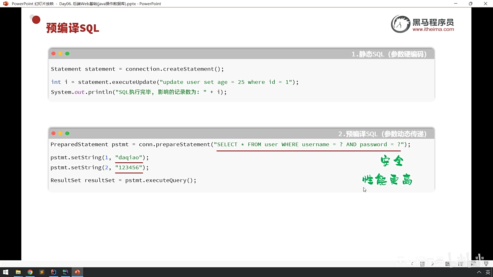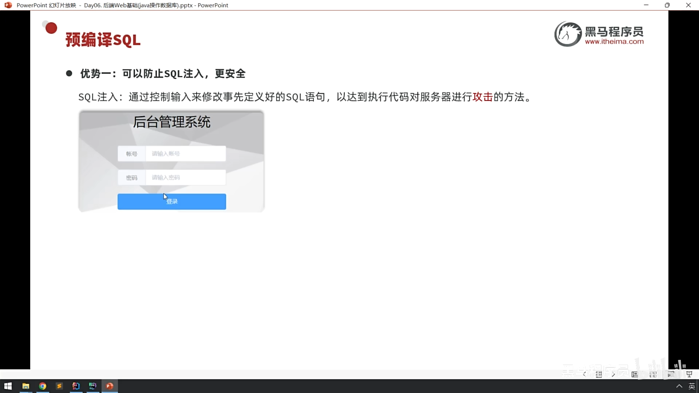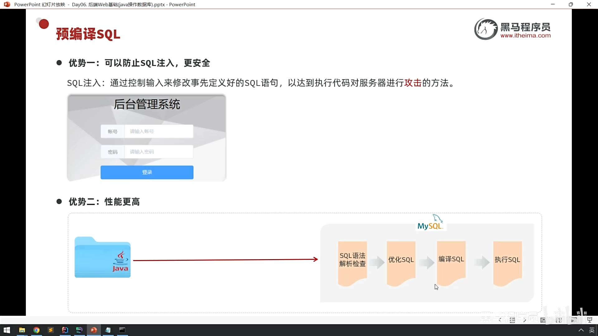
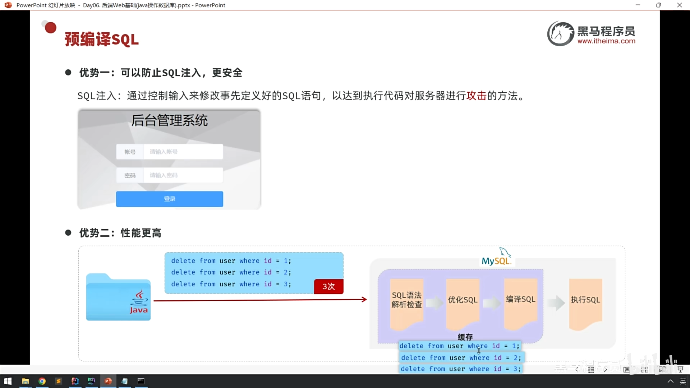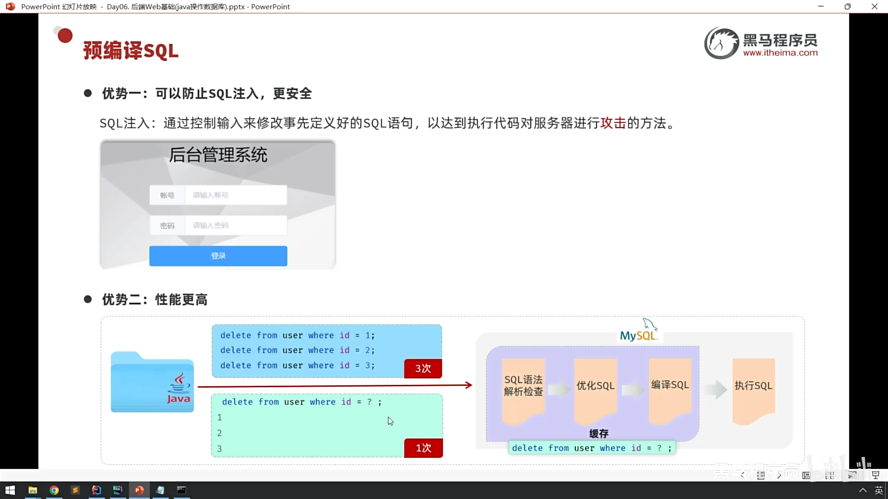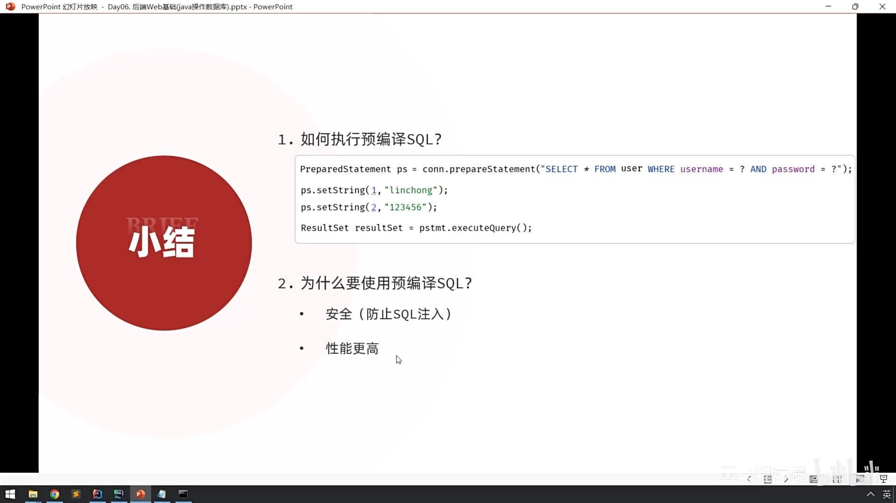