# 准备工作

---

## 01.开发规范-开发模式
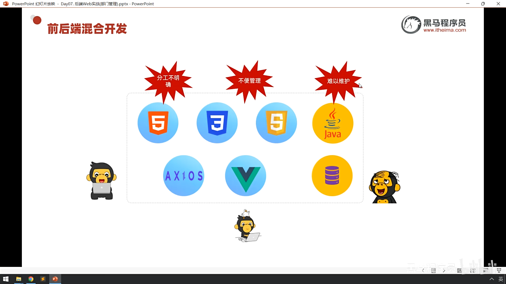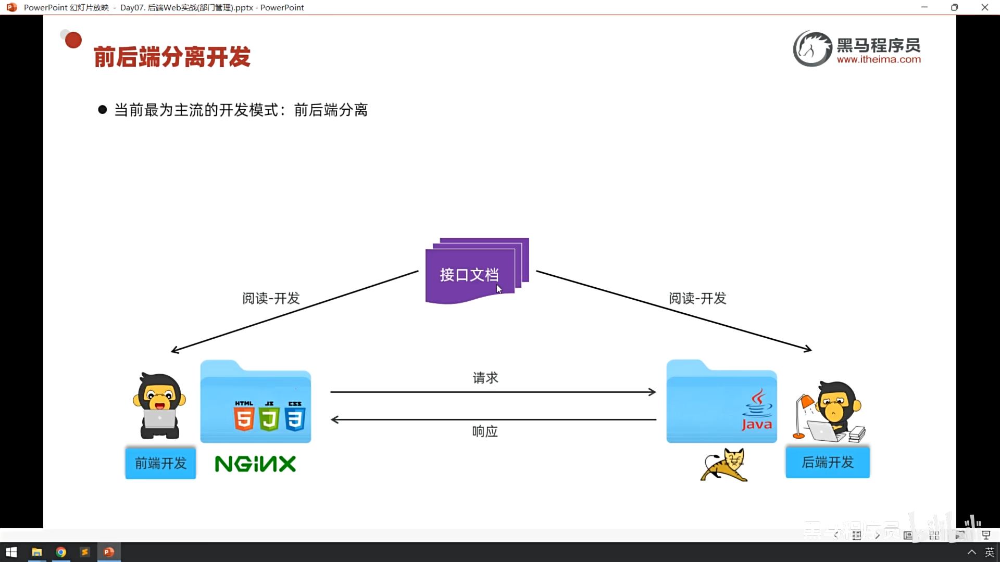
_**这个“接口”指的是什么？**_
1. 在软件开发（特别是前后端分离）的语境下，接口（API） 指的是 “后端给前端提供数据的窗口”。
    本质：它是一个网络地址（URL）。
    作用：前端（网页/APP）通过访问这个地址，向后端（服务器）请求数据或提交数据。
    比如：你在淘宝点击“搜索”，前端就会调用一个“搜索接口”，把你的关键词传给后端，后端把商品列表返回给前端。
2. 什么是“接口文档”？
    接口文档就是这个窗口的 “使用说明书” 或 “菜单”。
    它由后端开发编写，给前端开发看，规定了以下内容：
   * 地址在哪：接口的 URL 是什么（比如 /api/user/login）。
   * 传什么参：调用时需要带什么数据（比如用户名、密码）。
   * 返什么果：调用成功后，后端会返回什么格式的数据（比如 JSON 格式的用户信息）。
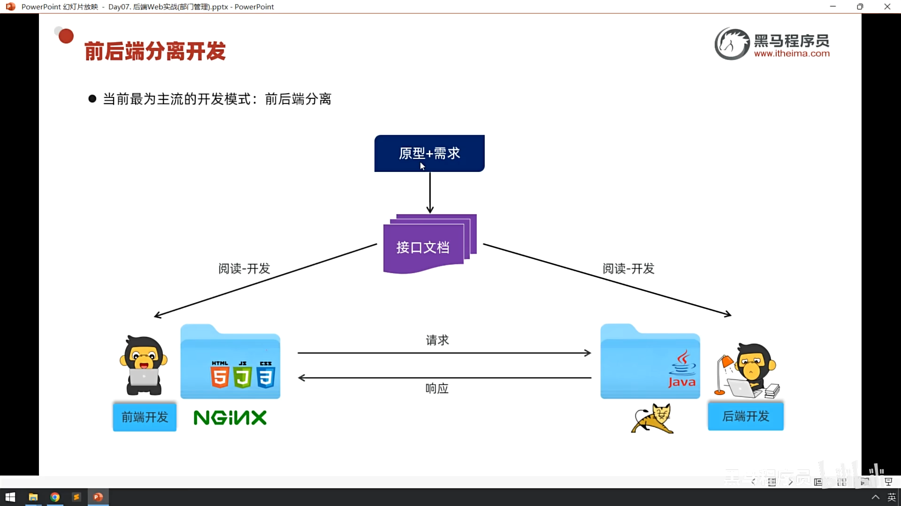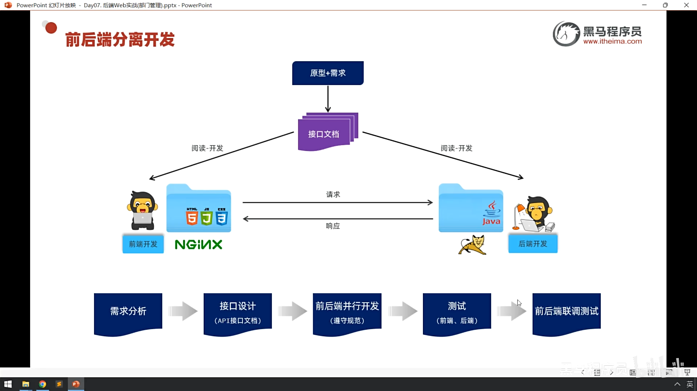
接口文档的一个案例:
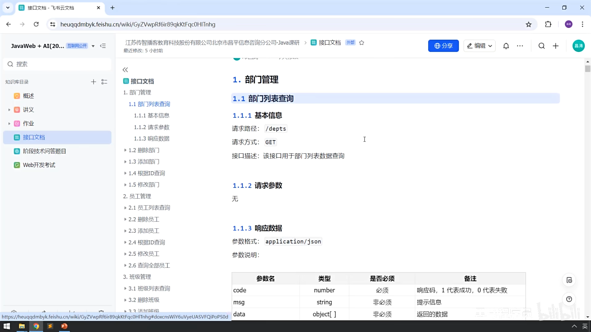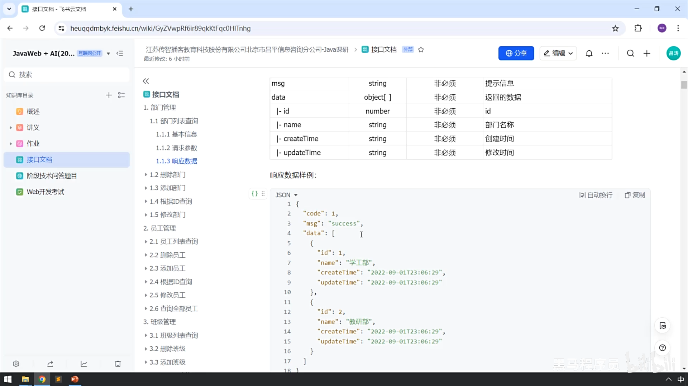
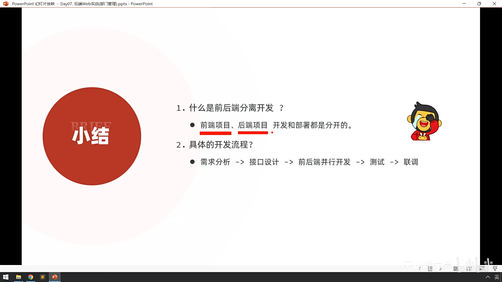

## 02.开发规范-Restful
### 什么是Restful?
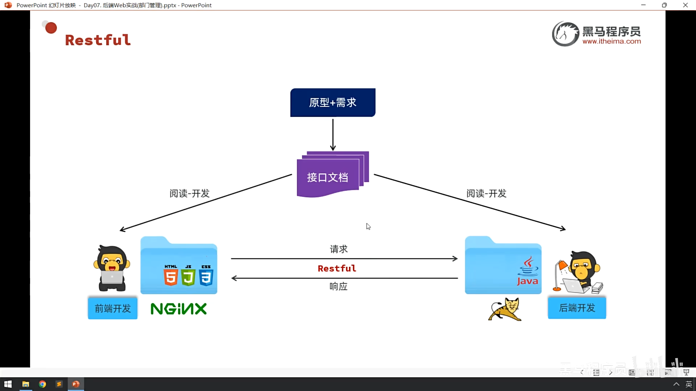
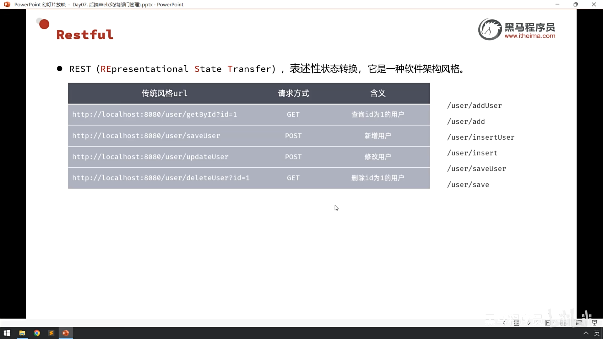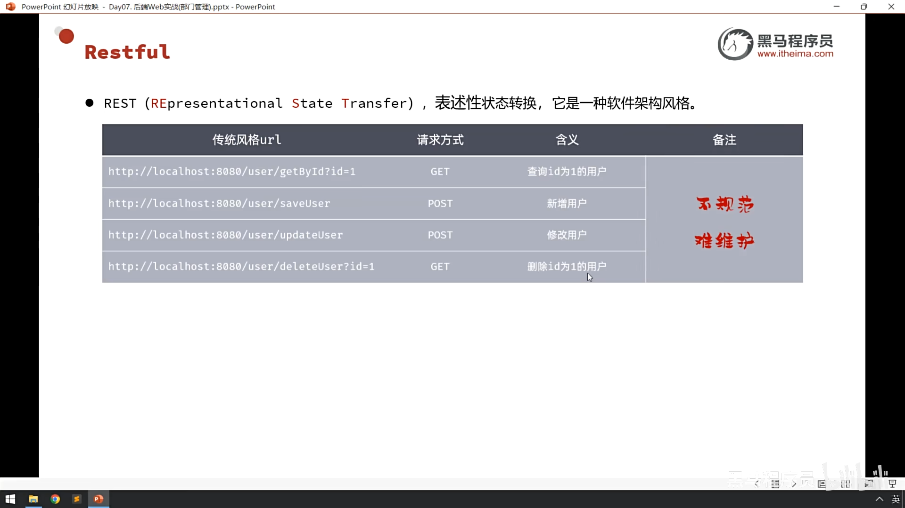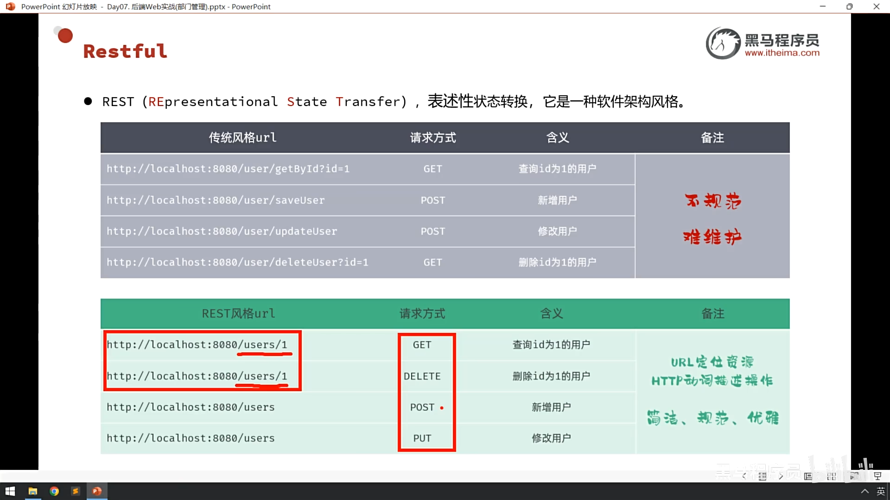
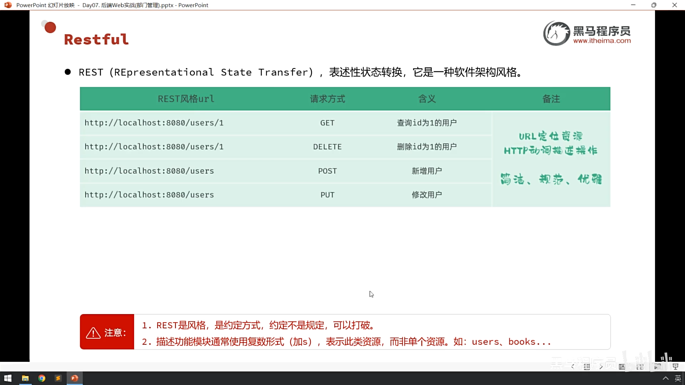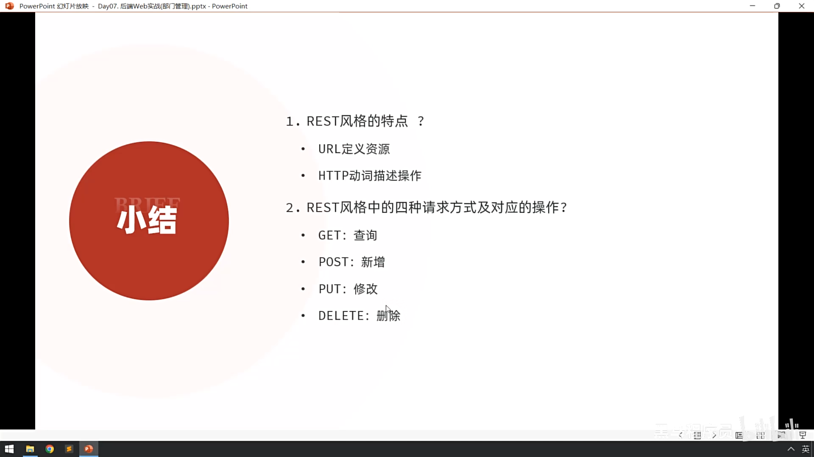

---

### Apifox
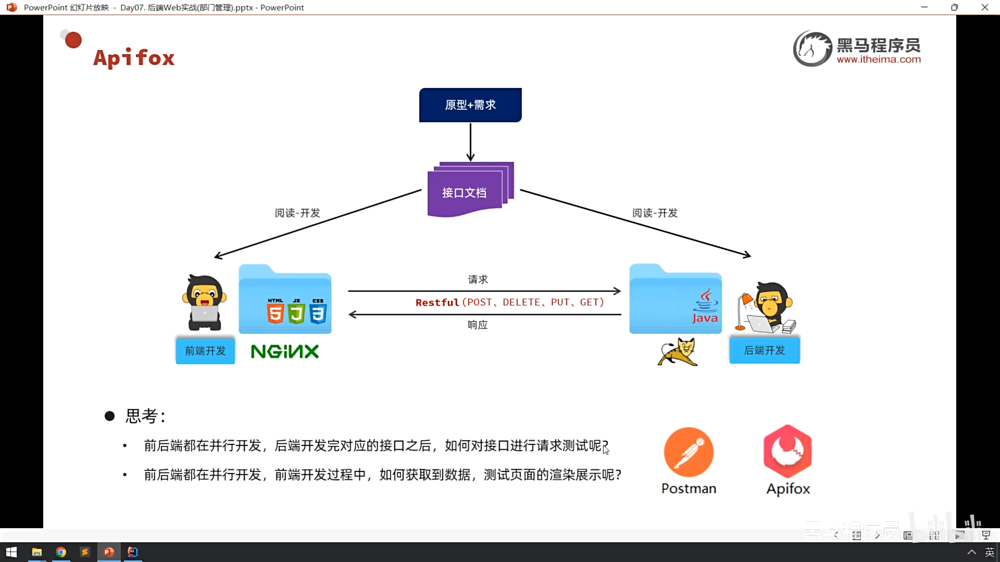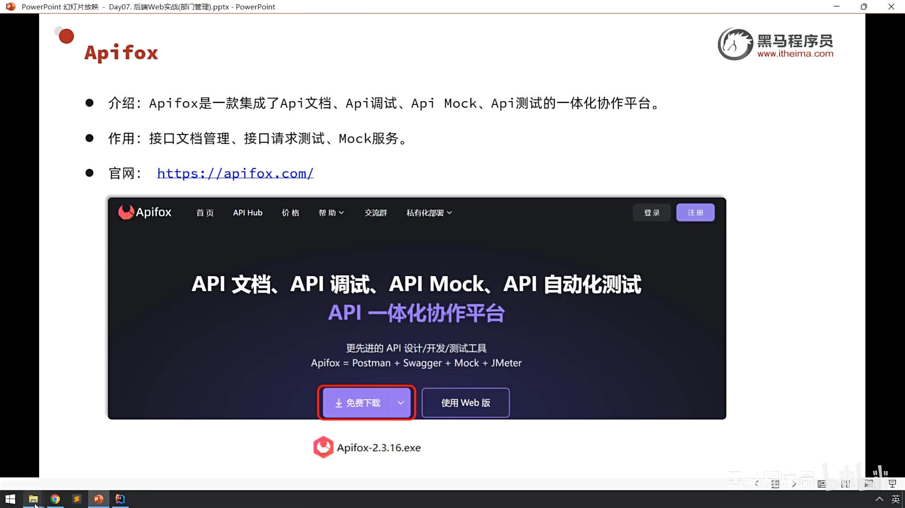
后端基础使用Apifox:
1. 先启动程序 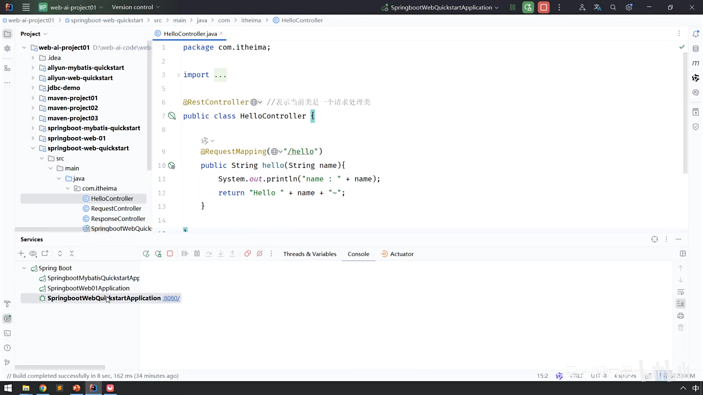
2. 点击快捷请求输出.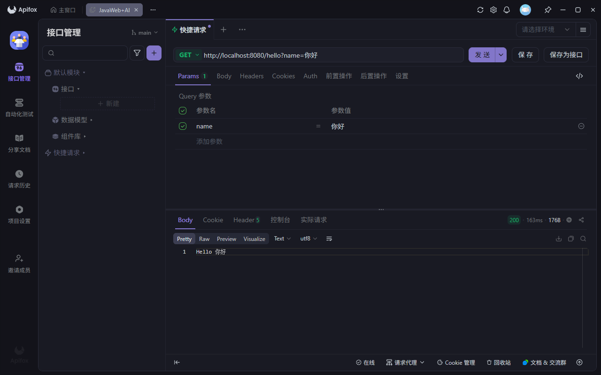
小结:
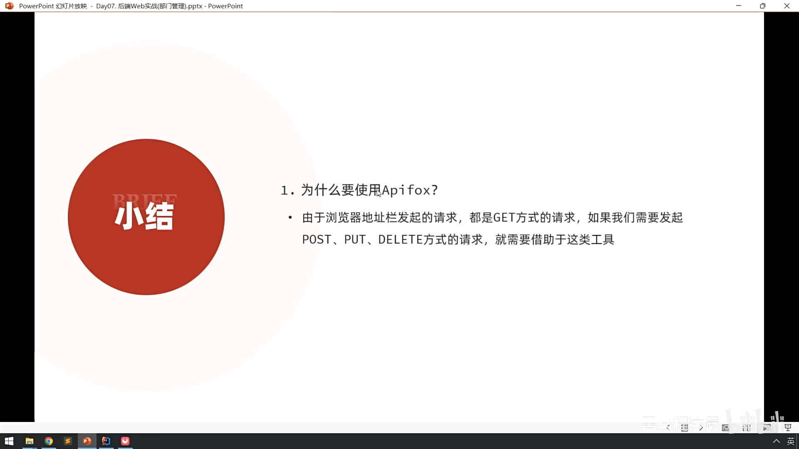

## 03.工程搭建
见 JavaWeb-project02
